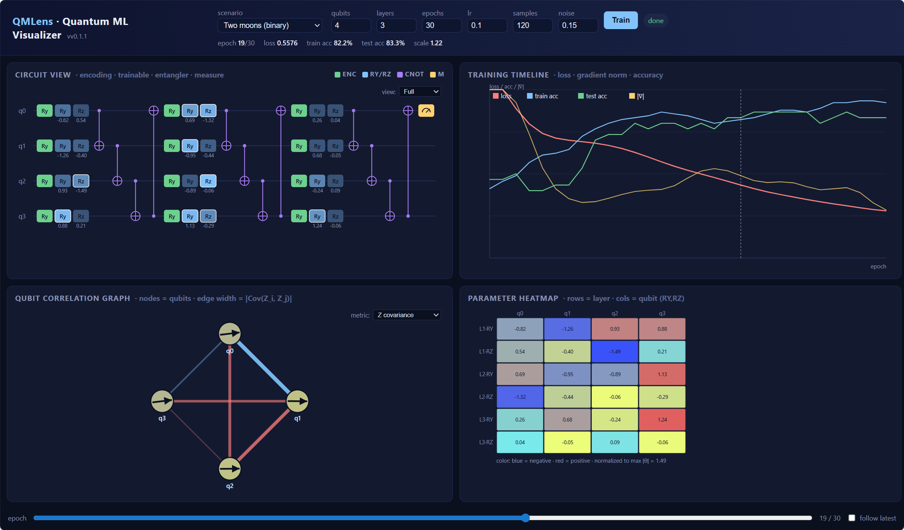

# QMLens — Quantum ML Visualizer

QMLens is a visualizer for exploring how a quantum machine learning circuit evolves during training.

1. **Circuit View** — gates colored by type, trainable rotations tinted by
   gradient magnitude, current parameter shown under each rotation.
2. **Training Timeline** — loss, train/test accuracy, gradient norm.
3. **Qubit Correlation View** — qubits arranged on a ring, edges weighted by
   $|Cov(Z_i, Z_j)|$, node color = $⟨Z_i⟩$.
4. **Parameter Heatmap** — rows = (layer, RY/RZ), cols = qubit.

A timeline slider scrubs through epochs; "follow latest" keeps the UI live
during training.




## Run

### Prebuilt combined container (quickest)

A single image that bundles the frontend and backend is published to GHCR on
every release:

```bash
docker run --rm -p 8000:8000 ghcr.io/kix-s/qmlens:latest
# UI + API: http://localhost:8000
# Docs:     http://localhost:8000/docs
```

Pin to a specific release with a tag (e.g. `ghcr.io/kix-s/qmlens:v0.1.0`).

### With Docker Compose (recommended for dev)

```bash
docker compose up --build
# UI:      http://localhost:5173
# API:     http://localhost:8000
# Docs:    http://localhost:8000/docs
```

The `frontend` container proxies `/api` to the `backend` service over the
internal Docker network (`VITE_API_TARGET=http://backend:8000`). The backend
exposes a healthcheck on `/api/health` and the frontend waits for it before
starting.

### Local dev (no Docker)

#### Backend
```bash
cd backend
python -m venv .venv && source .venv/bin/activate
pip install -r requirements.txt
cd ..
uvicorn backend.main:app --reload --port 8000
```

### Frontend
```bash
cd frontend
npm install
npm run dev
# open http://localhost:5173
```

Click **Train**. The UI polls `/api/runs/{id}` and animates as snapshots arrive.

## Learning journey

A 14-day beginner-friendly course that uses QMLens as the visual aid lives
in [vmql-journey/](vmql-journey/README.md). Start there if quantum or
quantum ML is new to you.

| Day | Topic | What you'll *see* in QMLens |
|-----|-------|------------------------------|
| [01](day-01-what-is-a-qubit.md) | What is a qubit? | The four qubit nodes in the Entanglement Graph |
| [02](day-02-measurement.md) | Measurement and probability | The ⟨Z⟩ value under each qubit |
| [03](day-03-single-qubit-gates.md) | Single-qubit gates & rotations | RY / RZ boxes in the Circuit View |
| [04](day-04-multi-qubits.md) | Multi-qubit systems | The four wires in the Circuit View |
| [05](day-05-entanglement.md) | Entanglement & CNOTs | The CNOT chain + edges in the Entanglement Graph |
| [06](day-06-reading-a-circuit.md) | Reading a circuit | A full lap across the Circuit View |
| [07](day-07-feature-encoding.md) | Encoding classical data | The green "Encoding" column |
| [08](day-08-variational-circuits.md) | Parameterized / variational circuits | The blue trainable RY/RZ gates |
| [09](day-09-loss-and-labels.md) | Turning measurements into a loss | The red loss curve |
| [10](day-10-gradients.md) | Gradients & the parameter-shift rule | Gradient norm (yellow) + gate tinting |
| [11](day-11-first-training-run.md) | Train your first QML model | The whole UI, live |
| [12](day-12-entanglement-graph.md) | Reading the Entanglement Graph | Edge thickness over epochs |
| [13](day-13-parameter-heatmap.md) | Reading the Parameter Heatmap | Heatmap cells over epochs |
| [14](day-14-putting-it-together.md) | Putting it all together | Everything, plus where to go next |

## Coming soon

- Measurement-attribution view (parameter-shift sensitivity per gate).
- State-projection view (PCA/UMAP of pre-measurement states).
- Qiskit backend.
- WebSocket streaming instead of polling.
